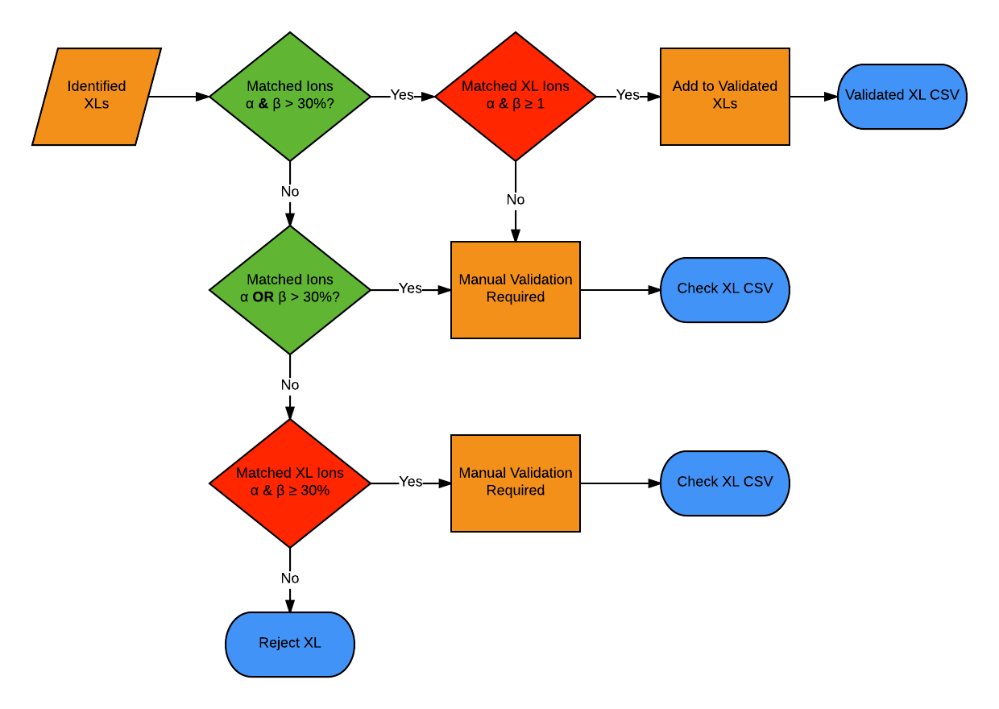

ValidateXL
==========

Validate_xl.py analyses the xQuest merged_xquest.xml files which are 
generated and stored in the xQuest result file after a completed
search. 
Validate_xl.py will run on multiple xQuest search results.

Inputs: merged_xquest.xml, fasta file, paths to each location, 
a list of result identifiers. Please note these identifiers will be used
in the resulting CSV output. 

Outputs: 3 CSV files for each result file analysed labelled as follows:
    * identifier_validated_results.csv
    These results have sufficent crosslink peaks and sequence coverage to
    be defined as genuine crosslinks.
    * identifier_rejected_results.csv
    These results have poor annotated sequence coverage and should not be
    regarded as crosslinks.
    * identifier_manual_results.csv
    These results would benefit from manual validation of the spectral 
    quality to confirm the presence of a crosslink.

Validate_xl.py currently works on linux based operating systems

To execute enter the files names and full paths for both the fasta file 
and the xml files. Validate_xl.py can be run directly from the directory it 
is stored in by typing "python validate_xl.py"
The result files will be placed in the same location as the XML files. 

===========================================================================
Author: Juliette M.B James 21/11/2017
This code is offered under a GNU GPLv3 License. For more details on 
licensing terms please see: https://choosealicense.com/licenses/gpl-3.0/
